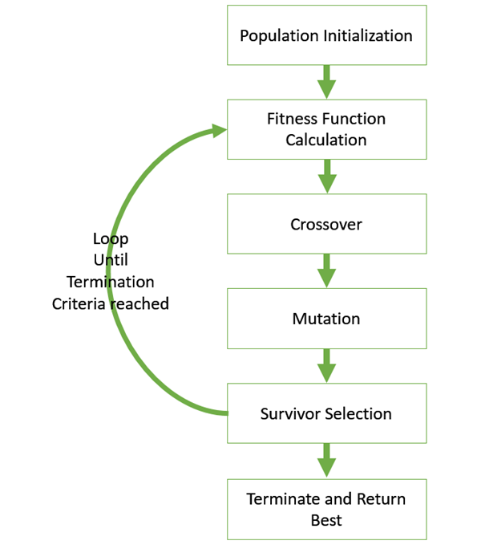

# Readme

Team members:

1. Shri Vidhatri M M - 2019113006
2. Anandhini Rajendran - 2019101055

The requirements needed are :

```python
pip3 install requests
pip3 install random
pip3 install numpy
```

To run the genetic algorithm code, run

```python
python3 main.py
```

# Genetic algorithm

It is a search-based optimisation technique based on Darwin's principles of Natural selection. It is inspired by genetics and can be used to find near-optimal solutions which are very inefficient when solved in the traditional techniques. Genetic algorithms do not need any derivative information and have very good parallel capabilities thus giving a set of good solutions instead of a single solution.

## Terminologies:

### Population:

A subset of all possible solutions to the problem in that particular state, analogous to the biological term of a population meaning a group of individuals in that current time.

### Chromosomes:

One particular solution given for the problem

### Gene:

One element in the chromosome

### Allele:

The value a gene takes in a particular chromosome

### Generation:

The evolution usually starts from a population of randomly generated individuals and is an iterative process, and the population in each iteration called a generation

### Selection:

The process of selecting parents which mate and recombine to create offsprings

### Offsprings/children:

The new population generated after the mating of parents and mutation if any.

### Mating pool:

The mating pool is formed by candidate solutions that the selection operators deem to have the highest fitness in the current population.

### Mutation:

Mutation is a genetic operator used to maintain genetic diversity from one generation of a population of genetic algorithm chromosomes to the next using random changes.

## The given problem:

We have been given a vector of size 11 which represents the coefficients of features to a dataset currently unknown to us. The vector given corresponds to an overfit model and we are expected to use a genetic algorithm to generalise the model to perform better on unseen data.

Based on the train and validation error output from the dataset, we have attempted varying different hyperparameters (see below) to achieve a better solution than the one we started with.  

## Understanding the algorithm

The basic structure of Genetic algorithm can be understood as:

- initial population( random or seeded by an overfit vector)
- select parents for mating
- apply crossover and mutation operators to generate new offsprings
- offsprings replace the existing individuals in the population



The algorithm is visually understood from the above image. A generalised pseudo-code for the same could be:

```python
Genetic_Algorithm()
   initialize population
   find fitness of the population
   
   while (termination criteria is reached) do
      parent selection
      crossover with probability pc
      mutation with probability pm
      decode and fitness calculation
      survivor selection
      find best
   return best
```

## Various functions:

### Initial population:

```python
def init_population():
    for i in range(population_size):
        parent_array[i] = mutation(parent_array[i])
```

We start the genetic algorithm by an initial population of size defined by the variable ***population_size.***

We have observed that the entire population if initialised using the overfit vector, results in having similar sultions and reduced diversity

Thus we have opted for initialising the parent array with all zero vectors and mutating them according to the mutation probability since it is the diversity in the population that ultimately leads to optimality.

### Fitness function:

```python
def fitness_calc_parent():
    for i in range(population_size):
        t_error, v_error = get_errors(SECRET_KEY,parent_array[i])
        f = a*t_error+b*v_error
        t_err_parent[i] = t_error
        v_err_parent[i] = v_error
        fitness_parent[i] = f
```

 

The fitness function is calculated using the train and validation errors that were obtained from the server requests. The values ***a*** and ***b*** were varied to get a better idea of the errors. The values worked well since both the train errors and validation errors were large and a perfect balance among them enabled us to reduce them simultaneously.

### Crossover:

```python
def calculate_b():
    x = random.uniform(0,1)
    y = x-0.5
    if(y>=0):
        b = ((2*(1-x))**-1)**((power+1)**-1)
    else:
        b = (2*x)**((power+1)**-1)
    return b

def cross_over(parent_1,parent_2):
    child_1 = []
    child_2 = []
    factor = calculate_b()
    f1 = (factor+1)/2
    f2 = (1 - factor)/2
    for i in range(no_params):
        child_1.append(parent_1[i]*f1 + parent_2[i]*f2)
        child_2.append(parent_2[i]*f1 + parent_1[i]*f2)
    return child_1,child_2
```

Crossover is analogous to reproduction and a biological crossover. 

Here, more than one parent is chosen and one or more offsprings are produced using the information in the parents.

The crossover probability is generally kept high as the fitness keeps increasing from one generation to the next in most cases.

In our code, we have kept the crossover probabilty as 1 to ensure best fitness scenario.

We have also found out by trial error that a binary crossover involving some level of randomness  with just two parents giving two children gives the best fitness in the children. This type of crossover is generally used in continuous search and is apt for the current dataset that we were given. This algorithm is found to be particularly useful in problems having multiple optimal solutions with a narrow global basin and in problems where the lower and upper bounds of the global optimum are not known. This type of search operator is very simular to the single point crossover.

There exist many other crossovers such as partially mapped crossover, Davis' order crossover, multi point crossover, binary crossover, order based crossover, shuffle crossover and so on.

### Mutation:

Mutation is a random small change in the chromosome to get a new solution. It is mainly useful to create diversity in the solution pool and avoid hgetting stuck at local minima.

The probability of mutation has been kept to 4/11 in our code, and the randomness created in such individuals has been varied and arrived at a conclusive value to attain maximum amount of diverse pool.

There are many different kinds of mutation operators used to implement mutations and most of them are inspired from natural mutation methodologies

```python
def mutation(vector):
    for i in range(no_params):
        prob = random.randint(1,11)
        
        if(prob<probability):
            if abs(vector[i]*random.uniform(0.95,1.05))<=10 :
                if vector[i] ==  0 : 
                    vector[i] = random.uniform(-0.05,0.05)
                else:
                    vector[i] = vector[i]*random.uniform(0.95,1.05)
            else : 
                vector[i] = random.uniform(-1,1)
    return vector
```

In our genetic algorithm, we have used arithmetic mutation operators to track the changes done by the mutation operator.

We have added a small random value to any zero valued gene, and we have multiplied the genes randmly by a value between (p,q).

We have varied (p,q) from (-0.05,0.05) to (-5,5) and almost 10 different combinations in between and found by trial and error that the code gives best fitness when the multiplication operator (p,q) of value (0.95,1.05) gives the best possible fitness of subsequent individuals.

### Mating pool Selection:

Mating pool selection for selecting parents of the next generations can be done in various ways.

One of those ways is fitness proportionate selection where the individual becomes a parent with a probability that is proportional to its fitness enabling the fitter individuals to have higher mating opportunities.

This type of selection can be viewed as Roulette wheel selection which follows the logic of calculating the sum of fitness, generating a random number x below the sum and keep adding the fitness of the individuals until the value of x is crossed and the last individual thus selected is the chosen one. This process is repeated until we get the desired number of parents for mating.

There are many other ways such as stochastic universal sampling, tournament selection, rank selection and so on.

```python
def create_child_array():
    test_list = fitness_parent
    K = no_of_children
    index = sorted(range(len(test_list)), key = lambda sub: test_list[sub])[:K]
    g = 0
    for i in range(no_of_children):
        p1 = parent_array[random.choice(index)]
        p2 = parent_array[random.choice(index)]
        c1,c2 = cross_over(p1,p2)
        child_array[g] = mutation(c1)
        child_array[g+1] = mutation(c2)
        g = g+2
```

In this genetic algorithm code, we have written, we have chosen the rank selection algorithm which was fast and effective.

In this kind of mating pool selection, we have sorted the fitness of all the prospective parents ( a combination of previous generation parents and children) , and then we have chosen the best x children and best population_size - x parents among which the mating pairs are chosen randomly.

After the parents are chosen, crossover is done over them and the children are mutated to make the best possible use of the diverse pool of data.

## Hyperparameters:

```python
no_params = 11  #no of parameters
a = 1           #factor to multiply with t_error
b = 1           #factor to multiply with v_error
population_size = 10
size = (population_size,no_params)  #size of population vector
power = 3
probability = 4    #probability for mutation between 1 and 11
no_of_children = 5  #no of parents to be mated
parents_in_generation = 10 #no of parents taken from parent array
num_generation = 10
```

> no_params

This parameter describes the number of genes in an individual i.e. the number of vectors in a solution. This value is set to 11 according to the question

> a & b

These variables describe the coefficients of train and validation errors in the fitness function. These values 1,1 were found to be appropriate for these parameters

> population_size

We started out with the value of 10 for population size and soon realised that that specific value was effective to analyse the fitness as it was not too less to hinder crossovers and it was not too high to slow down the genetic algorithm.

This parameter has been set to a value of 10.

> parents_in_generation

This parameter defines the mating pool size of the population. The value of this parameter has been kept as 10 i.e. equal to population_size to keep the generation numbers under check for the efficiency of the code.

> power

This parameter represents the binary crossover probability. The parameter is set to 3 which determines that the binary crossover happens at a spefic value that is a mathematical operator  of the power variable. In the sense of the algorithm, it determines how different the children turn out from the parents.

> probability

This paramater determines the mutation probability of the algorithm. This value is sensitive and it was fine tuned to the value of 4 to make sure that the mutation creates enough diversity in the population, but not high enough to deviate from the actual answer. 

Throughout the implementation of the algorithm, thr probability as increased from 4 to 7 and then again to 8 and reduced to 6 and 2. We observed the effects of these values on the fitness function and finally concluded the value to be equal 4 for a balance in the mutation.

> no_of_children

This parameter determines how many children and how many parents will be included in the mating pool in order to create the next generation. This parameter was set to 5 as it involved the appropriate number of children and also equal number of parents in order to nullify the negative effects of mutation. But the value also makes sure that there are enough number of children considered to make a significant change to the population.

> num_generation

This parameter determined the number of generations that the algorithm needs to run through to get to a decent level of fitness value. We initially set it to 10 to run and test the algorithm for a few generations with varied values of the above hyper parameters. Then we concluded the algorithm at 200 generations and set the num_generation parameter value to 200.
